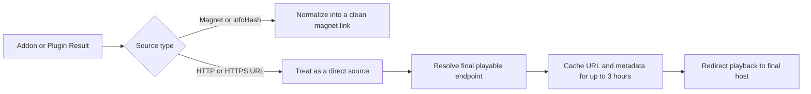

<div align="center">

# Providra Help Guide

**A practical setup and troubleshooting guide for Stremio addons, Nuvio plugins, direct streams, and Syncler packages.**


</div>

> [!IMPORTANT]
> **Using Syncler Stable?** Prefer **unconfigured Stremio addon manifests** that return magnet links.  
> **Using direct streams?** Use **Syncler beta `2.1.1.7 (v302010107)` or higher** and turn off `Skip resolving non-debrid sources`.

---

## Choose your setup

| Your setup | Recommended approach |
|---|---|
| Syncler Stable `2.0.1.3.2 (v24421302)` | Prefer unconfigured Stremio addon manifests and magnet-style results. |
| Syncler beta `2.1.1.7 (v302010107)` or higher | Configured or unconfigured manifests are supported. Direct streams have worked correctly during testing. |
| Direct addon or plugin streams | Turn off `Skip resolving non-debrid sources`. |
| Missing valid direct links | Temporarily turn off Smart Title Filtering. |
| More links appear on a second scrape | Increase Repeated Calls, then reinstall the generated package. |

<details>
<summary><strong>Table of contents</strong></summary>

- [Quick setup](#quick-setup)
- [Addons and plugins](#addons-and-plugins)
- [Syncler version compatibility](#syncler-version-compatibility)
- [Required setting for direct streams](#required-setting-for-direct-streams)
- [Configured and unconfigured manifests](#configured-and-unconfigured-manifests)
- [How sources are processed](#how-sources-are-processed)
- [Direct-stream relay and cache](#direct-stream-relay-and-cache)
- [AIOStreams notes](#aiostreams-notes)
- [Source-processing settings](#source-processing-settings)
- [Refreshing the Syncler package](#refreshing-the-syncler-package)
- [Logs and privacy](#logs-and-privacy)
- [Troubleshooting](#troubleshooting)
- [Recommended defaults](#recommended-defaults)

</details>

---

## Quick setup

### Syncler Stable

For a stable Syncler release such as `2.0.1.3.2 (v24421302)`, use **unconfigured Stremio addon manifests** whenever possible.

A configured addon will often return direct hosting links instead of magnet links. Many direct-stream services return the playable file through an HTTP `302` redirect. During testing, the stable Syncler player did not reliably follow these redirects and displayed:

```text
Source error — Response code: 302
```

For the most reliable stable-version experience, use addon configurations that return magnet links.

### Syncler Beta or higher

For `Syncler beta 2.1.1.7 (v302010107)` or higher, direct streams have worked correctly during testing. These versions appear to follow the redirects commonly used by debrid and hosting services.

Configured Stremio addons are fine on these versions. They may return magnets, direct debrid links, direct hosting links, or a mixture of source types.

---

## Addons and plugins

Providra supports Stremio addons, Nuvio plugins, or both.

| Provider type | Best for | Typical results |
|---|---|---|
| **Stremio Addons** | Bridging compatible stream addons through a `manifest.json` URL | Magnet links, raw `infoHash` values, direct debrid links, direct hosting links, or mixed results |
| **Nuvio Plugins** | Scraper-style sources that can play without requiring a third-party debrid service | Direct video links, hoster links, streaming playlists, and free streaming sources |

### Stremio addons

Supported addons must expose a playable stream resource. Compatible results can include movies, TV series, and supported anime streams.

Catalog-only, metadata, subtitle, live TV, and channel addons are skipped because they do not provide playable source links.

### Nuvio plugins

Compatible plugins use a manifest containing a scraper list. Each enabled scraper is converted into a Syncler Express provider.

> [!TIP]
> You can use both provider types together, but combining them may reduce the number of links shown in Syncler. For the most complete results, use one provider type at a time when possible.

---

## Syncler version compatibility

| Syncler version | Recommended Stremio addon setup | Direct-stream behavior |
|---|---|---|
| Stable `2.0.1.3.2 (v24421302)` | Prefer unconfigured manifests | Magnet links are the safer option. Direct redirects may fail with a `302` source error. |
| Beta `2.1.1.7 (v302010107)` or higher | Configured or unconfigured manifests | Direct-stream redirects have worked during testing. |

The important distinction is whether a configured addon returns a direct stream URL instead of a magnet link. A direct stream is not inherently broken; the stable Syncler player may simply refuse to follow the redirect used by the source host.

---

## Required setting for direct streams

When using direct streams from addons or plugins, open:

```text
Settings → Source → Resolving
```

Turn this option **off**:

```text
Skip resolving non-debrid sources
```

> [!WARNING]
> When this setting is enabled, Syncler may refuse to resolve or play a valid direct source.

This matters when using configured Stremio addons, AIOStreams direct results, Nuvio plugins, free hosting links, and direct debrid links.

---

## Configured and unconfigured manifests

A configured Stremio addon manifest often contains a long configuration path. It may include debrid settings or private configuration data.

```text
# Configured manifest example
https://comet.stremio.ru/7c82135a...3934734d/ey...ImEifQ/manifest.json

# Unconfigured manifest example
https://comet.stremio.ru/manifest.json
```

| Situation | Recommended manifest |
|---|---|
| Stable Syncler and you want the safest setup | Unconfigured manifest |
| Stable Syncler and the configured addon returns only magnets | Configured manifest may still be fine |
| Syncler beta `2.1.1.7 (v302010107)` or higher | Configured or unconfigured manifest |
| You want debrid-resolved direct links | Use Syncler beta `2.1.1.7 (v302010107)` or higher |

> [!CAUTION]
> Configured manifest URLs may contain private tokens, debrid credentials, or encoded settings. **Do not post configured manifest URLs publicly.**

---

## How sources are processed

Each addon result is processed independently based on its actual source type.



<details>
<summary><strong>Magnet-style results</strong></summary>

When an addon returns a magnet link or raw `infoHash`, the result is normalized into a clean magnet link.

Torrent-style results keep fields such as:

- Hash
- Trackers
- Seeds
- Peers
- Playback filename hints when available

</details>

<details>
<summary><strong>Direct-stream results</strong></summary>

When an addon returns an HTTP or HTTPS URL, the result is treated as a direct source.

Direct results keep fields such as:

- Direct source URL
- Host
- Filename
- File size

Torrent-only fields are removed from direct entries so Syncler does not mistake them for magnet results.

</details>

<details>
<summary><strong>Mixed responses</strong></summary>

A single addon response may safely contain both magnets and direct streams. This is common with aggregator addons and debrid-configured addons.

</details>

---

## Direct-stream relay and cache

Direct addon streams use a lightweight relay. The relay does **not** proxy the full video file. Video bytes are streamed directly from the final host after Syncler follows the redirect.

The relay:

1. Receives Syncler’s initial probe request.
2. Resolves the addon URL.
3. Follows redirects until it reaches the final playable endpoint.
4. Detects the media type and file size.
5. Stores the resolved URL and metadata in memory for up to **3 hours**.
6. Answers the initial Syncler probe locally.
7. Returns a lightweight redirect for playback and seek requests.

The 3-hour cache prevents repeated resolver calls every time the player requests a new byte range while buffering or seeking.

> [!NOTE]
> Even though the relay correctly resolves the file, stable Syncler may still reject the playback redirect with `Source error — Response code: 302`. Direct addon streams are therefore recommended for `Syncler beta 2.1.1.7 (v302010107)` or higher.

---

## AIOStreams notes

AIOStreams is handled as a Stremio addon. It keeps a recognizable label and slower request pacing because it can aggregate a large number of results.

AIOStreams may return magnet links, raw `infoHash` values, direct debrid links, direct hosting links, or mixed results from several addons and debrid services. Each result is handled independently.

| Syncler version | AIOStreams recommendation |
|---|---|
| Stable | Configure AIOStreams to return magnet-style results whenever possible. |
| Beta `2.1.1.7 (v302010107)` or higher | Magnets and direct streams can be returned together. |

---

## Source-processing settings

### Smart Title Filtering

Smart Title Filtering validates direct-source titles and TV episodes before returning links. It removes non-alphanumeric characters and compares the remaining text with the requested media title.

This can reduce the number of available links. Streams such as M3U playlists often do not contain a useful title, which may cause valid sources to be filtered out unintentionally.

Turn Smart Title Filtering **off** when:

- Valid direct sources are missing.
- Playlist-based streams disappear.
- Free hosting links are being filtered too aggressively.

### Repeated Calls

Repeated Calls controls how long Syncler waits for plugin and AIOStreams results by requesting source URLs multiple times.

Increase this value when:

1. The first scrape returns fewer links than expected.
2. You refresh or play the same title again after scraping finishes.
3. The second run returns additional links.

That pattern usually means Syncler ended the initial request too early.

> [!IMPORTANT]
> Changes to package-related settings require reinstalling the default Syncler package.

---

## Refreshing the Syncler package

When package-related settings change, fully reinstall the generated Syncler package. Do not simply update the existing package.

1. Open Syncler.
2. Go to:

   ```text
   Settings → Vendors + Packages → Packages → Installed Packages → Providra Express
   ```

3. Select `Uninstall`.
4. Go back to:

   ```text
   Vendors + Packages → Providra Vendor
   ```

5. Scroll down and select `Run Default Setup`.

### If problems continue

Delete the entire vendor package, close Syncler, clear the Syncler cache, and reinstall the vendor URL. The vendor URL is shown at the bottom of the Settings tab.

---

## Logs and privacy

Keep server logs disabled unless troubleshooting is required. Some addons place private tokens, debrid credentials, or encoded account settings directly inside URLs. When logs are enabled, these values may appear in manifest, resolver, or CDN URLs.

> [!CAUTION]
> Do not share raw server logs, configured manifest URLs, resolver URLs, CDN URLs, debrid tokens, or encoded addon configuration paths publicly.

If private information is exposed during testing, rotate the affected credential afterward.

---

## Troubleshooting

| Issue | Recommended fix |
|---|---|
| Direct source fails with `Response code: 302` | Use Syncler beta `2.1.1.7 (v302010107)` or higher, use an unconfigured manifest that returns magnets, or remove the debrid configuration when using stable Syncler. |
| Direct source cannot be resolved | Open `Settings → Source → Resolving` and turn off `Skip resolving non-debrid sources`. |
| Direct sources do not appear | Restart the local server, reinstall the default package, confirm the addon returned HTTP direct links or magnets, and temporarily turn off Smart Title Filtering. Enable logs only while troubleshooting. |
| The second scrape returns more links | Increase Repeated Calls so plugins and AIOStreams have more time to return results. |
| Playback freezes or pauses | Try another source, another addon, a smaller file, the same source in another player, or check whether the hosting service or CDN is slow. Resolved direct-stream URLs are cached for 3 hours. |
| Package changes do not take effect | Fully uninstall the generated package and run Default Setup again. Updating the existing package is not enough. |
| Logs contain private URLs or credentials | Disable logs after testing and rotate any exposed credentials. |

---

## Recommended defaults

| Setting | Recommended value |
|---|---|
| Stable Syncler with Stremio addons | Prefer unconfigured addon manifests |
| Direct addon streams | Use Syncler beta `2.1.1.7 (v302010107)` or higher |
| `Skip resolving non-debrid sources` | Off when using direct streams |
| Smart Title Filtering | Off unless you need stricter matching |
| Repeated Calls | Increase only when later scrapes return more links |
| Server logs | Off unless troubleshooting |

---

## Final checklist

For the most reliable stable Syncler setup, use Stremio addons that return magnet links.

For direct debrid links, direct hosting links, and plugin streams:

- Use `Syncler beta 2.1.1.7 (v302010107)` or higher.
- Open `Settings → Source → Resolving`.
- Turn off `Skip resolving non-debrid sources`.

---

<div align="center">

**Keep configured URLs and logs private.**

</div>
