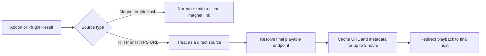

<div align="center">

# Providra Help Guide

**A practical setup and troubleshooting guide for Stremio addons, Nuvio plugins, direct streams, and Syncler packages.**


</div>

> [!IMPORTANT]
> **Syncler Stable Version:** Use **unconfigured debrid Stremio addons**, which return only magnet-style results.<br><br>
> **Syncler Beta Version:** Use configured or unconfigured debrid Stremio addons. These addons can return magnets or direct links. Within Syncler’s settings, turn off `Skip resolving non-debrid sources`.

---

<details>
<summary><strong>Table of contents</strong></summary>

- [TMDB API key required](#tmdb-api-key-required)
- [Quick setup](#quick-setup)
- [Addons and plugins](#addons-and-plugins)
- [Required setting for direct streams](#required-setting-for-direct-streams)
- [Configured and unconfigured addon manifest URLs](#configured-and-unconfigured-addon-manifest-urls)
- [How sources are processed](#how-sources-are-processed)
- [Direct-stream relay and cache](#direct-stream-relay-and-cache)
- [AIOStreams notes](#aiostreams-notes)
- [Source-processing settings](#source-processing-settings)
- [Refreshing the Syncler package](#refreshing-the-syncler-package)
- [Logs and privacy](#logs-and-privacy)
- [Troubleshooting](#troubleshooting)

</details>

---

<a id="tmdb-api-key-required"></a>
## 🔑 TMDB API Key Required

Providra requires a free TMDB API key to function.

You can create a TMDB account and request your API key by following the official [TMDB API Getting Started guide](https://developer.themoviedb.org/docs/getting-started).

> [!TIP]
> TMDB recommends completing the API key registration process from a desktop browser.

---

## Quick setup

### Syncler Stable

For a stable Syncler release such as `2.0.1.3.2 (v24421302)`, use **unconfigured debrid Stremio addons**. This means leaving your debrid API key blank so the addons return only magnet-style results instead of debrid-resolved direct streams.

When you enter your debrid API key inside a Stremio addon, the configured addon will often return direct hosting links instead of magnet links. Many addon services return the playable file through an HTTP `302` redirect. During testing, the current stable version of Syncler did not follow these redirects and displayed:

```text
Source error — Response code: 302
```

If you are using Syncler Stable, leave the debrid settings in the Stremio addon unconfigured so that it returns magnet-style results only. Add your debrid service credentials in Syncler instead.

### Syncler Beta or Higher (Recommended)

For `Syncler beta 2.1.1.7 (v302010107)` or higher, direct streams have worked correctly during testing. These versions appear to follow the redirects commonly used by Stremio addons when a debrid service is configured.

With Syncler beta versions, you can enter your debrid API key inside a Stremio addon. The configured addon may return magnet links, direct debrid links, direct hosting links, or a mixture of source types.

---

## Addons and Plugins

Providra supports Stremio addons, Nuvio plugins, or both.

| Provider type | Best for | Typical results |
|---|---|---|
| **Stremio Addons** | Bridging compatible stream addons through a `manifest.json` URL | Magnet links, raw `infoHash` values, direct debrid links, direct hosting links, or mixed results |
| **Nuvio Plugins** | Scraper-style sources that can play without requiring a third-party debrid service | Direct video links, hoster links, streaming playlists, and free streaming sources |

### Stremio addons

Supported addons must expose a playable stream resource. Compatible results can include movies, TV series, and supported anime streams.

Catalog-only, metadata, subtitle, live TV, and channel addons are skipped because they do not provide playable source links.

### Nuvio plugins

Compatible plugins use a manifest containing a scraper list. Each enabled scraper is converted into a Syncler Express provider.

> [!TIP]
> You can use addons and plugins together, but combining them may reduce the number of source links displayed in Syncler. For the best results, use one provider type at a time whenever possible.

---

## Required setting for direct streams

When using direct streams from addons or plugins, open:

```text
Settings → Source → Resolving
```

Turn this option **off**:

```text
Skip resolving non-debrid sources
```

> [!WARNING]
> When this setting is enabled, Syncler may not play a valid direct source.

This matters when using configured Stremio addons, AIOStreams direct results, Nuvio plugins, free hosting links, and direct debrid links.

---

## Configured and unconfigured addon manifest URLs

A configured Stremio addon manifest URL often contains a long configuration path. It may include debrid settings or private configuration data.


**Configured manifest example**
```
https://comet.stremio.ru/7c82135a...3934734d/ey...ImEifQ/manifest.json
```

**Unconfigured manifest example**
```
https://comet.stremio.ru/manifest.json
```

> [!CAUTION]
> Configured manifest URLs may contain private tokens, debrid credentials, or encoded settings. **Do not post configured manifest URLs publicly.**

---

## How sources are processed

Each addon result is processed independently based on its actual source type. Resolved direct streams are cached for up to 3 hours to speed up Syncler probe requests and streaming. After the cache expires, the next request fetches the source again and repeats the same cycle.




<details>
<summary><strong>Magnet-style results</strong></summary>

When an addon returns a magnet link or raw `infoHash`, the result is normalized into a clean magnet link.

Torrent-style results keep fields such as:

- Hash
- Trackers
- Seeds
- Peers
- Playback filename hints when available

</details>

<details>
<summary><strong>Direct-stream results</strong></summary>

When an addon returns an HTTP or HTTPS URL, the result is treated as a direct source.

Direct results keep fields such as:

- Direct source URL
- Host
- Filename
- File size

Torrent-only fields are removed from direct entries so Syncler does not mistake them for magnet results.

</details>

<details>
<summary><strong>Mixed responses</strong></summary>

A single addon response may safely contain both magnets and direct streams. This is common with aggregator addons and debrid-configured addons.

</details>

---

## Direct-stream relay and cache

Direct addon streams use a lightweight relay. The relay does **not** proxy the full video file. Video bytes are streamed directly from the final host after Syncler follows the redirect.

The relay:

1. Receives Syncler’s initial probe request.
2. Resolves the addon URL.
3. Follows redirects until it reaches the final playable endpoint.
4. Detects the media type and file size.
5. Stores the resolved URL and metadata in memory for up to **3 hours**.
6. Answers the initial Syncler probe locally.
7. Returns a lightweight redirect for playback and seek requests.

The 3-hour cache prevents repeated resolver calls every time the player requests a new byte range while buffering or seeking.

---

## AIOStreams notes

AIOStreams is handled as a Stremio addon. It keeps a recognizable label and slower request pacing because it can aggregate a large number of results.

AIOStreams may return magnet links, raw `infoHash` values, direct debrid links, direct hosting links, or mixed results from several addons and debrid services. Each result is handled independently.

| Syncler version | AIOStreams recommendation |
|---|---|
| Stable `2.0.1.3.2 (v24421302)` | Leave the addons unconfigured whenever possible, so AIOStreams returns magnet-style results instead of direct links.  |
| Beta `2.1.1.7 (v302010107)` or higher | AIOStreams can return magnet links and direct streams together, and any video redirects will be followed. |

---

## Source-processing settings

### Smart Title Filtering

Smart Title Filtering validates direct-source titles and TV episodes before returning links. It removes non-alphanumeric characters and compares the remaining text with the requested media title.

This can reduce the number of available links. Streams such as M3U playlists often do not contain a useful title, which may cause valid sources to be filtered out unintentionally.

Turn Smart Title Filtering **off** when:

- Valid direct sources are missing.
- Playlist-based streams disappear.
- Free hosting links are being filtered too aggressively.

### Repeated Calls

Repeated Calls controls how long to keep Syncler waiting for addons and plugins to return results. This is useful when an addon or plugin, such as AIOStreams, takes longer to return results.

Increase this value when:

* The first scrape returns fewer links than expected.
* You can test this by refreshing or going back and clicking play on the same title again after scraping finishes. If more links appear the second time around due to caching, it means Syncler did not wait long enough, and raising the Repeated Calls value will be beneficial.

> [!IMPORTANT]
> Changes to Repeated Calls require reinstalling the default Providra Express package for the settings to take effect.

---

## Refreshing the Syncler package

When adding or deleting manifest URLs, or when changing the Repeated Calls amount, you must fully reinstall the Providra Express package. Do not simply update it. This will not work and may cause your links to stop showing up.

1. Open Syncler.

2. Go to:

   ```text
   Settings → Vendors + Packages → Packages → Installed Packages → Providra Express
   ```

3. Select `Uninstall`.

4. Go back to:

   ```text
   Vendors + Packages → Providra Vendor
   ```

5. Scroll down and select `Run Default Setup`.

### If you have any persistent issues

Delete the entire vendor package, close Syncler, clear the Syncler cache, and reinstall the vendor URL. The vendor URL is shown at the bottom of the Settings tab.


---

## Logs and privacy

Keep server logs disabled unless troubleshooting is required. Some addons place private tokens, debrid credentials, or encoded account settings directly inside URLs. When logs are enabled, these values may appear in manifest, resolver, or CDN URLs.

> [!CAUTION]
> Do not share raw server logs, configured manifest URLs, resolver URLs, CDN URLs, debrid tokens, or encoded addon configuration paths publicly.

If private information is exposed during testing, rotate the affected credential afterward.

---

## Troubleshooting

| Issue | Recommended fix |
|---|---|
| Direct source fails with `Response code: 302` | Use Syncler beta `2.1.1.7 (v302010107)` or higher, or use an unconfigured debrid addon URL so the addon returns only magnet-style results. |
| Direct source cannot be resolved | Open `Settings → Source → Resolving` and turn off `Skip resolving non-debrid sources`. |
| Direct sources do not appear | Restart the local server, reinstall the default package, confirm the addon returned HTTP direct links or magnets, and temporarily turn off Smart Title Filtering. Enable logs only while troubleshooting. |
| The second scrape returns more links | Increase Repeated Calls so plugins and AIOStreams have more time to return results. |
| Playback freezes or pauses | Try another source, another addon, a smaller file, the same source in another player, or check whether the hosting service or CDN is slow. Resolved direct-stream URLs are cached for 3 hours. |
| Package changes do not take effect | Fully uninstall the generated package and run Default Setup again. Updating the existing package is not enough. |
| Logs contain private URLs or credentials | Disable logs after testing and rotate any exposed credentials. |

---

<div align="center">

**Keep configured URLs and logs private.**

</div>
